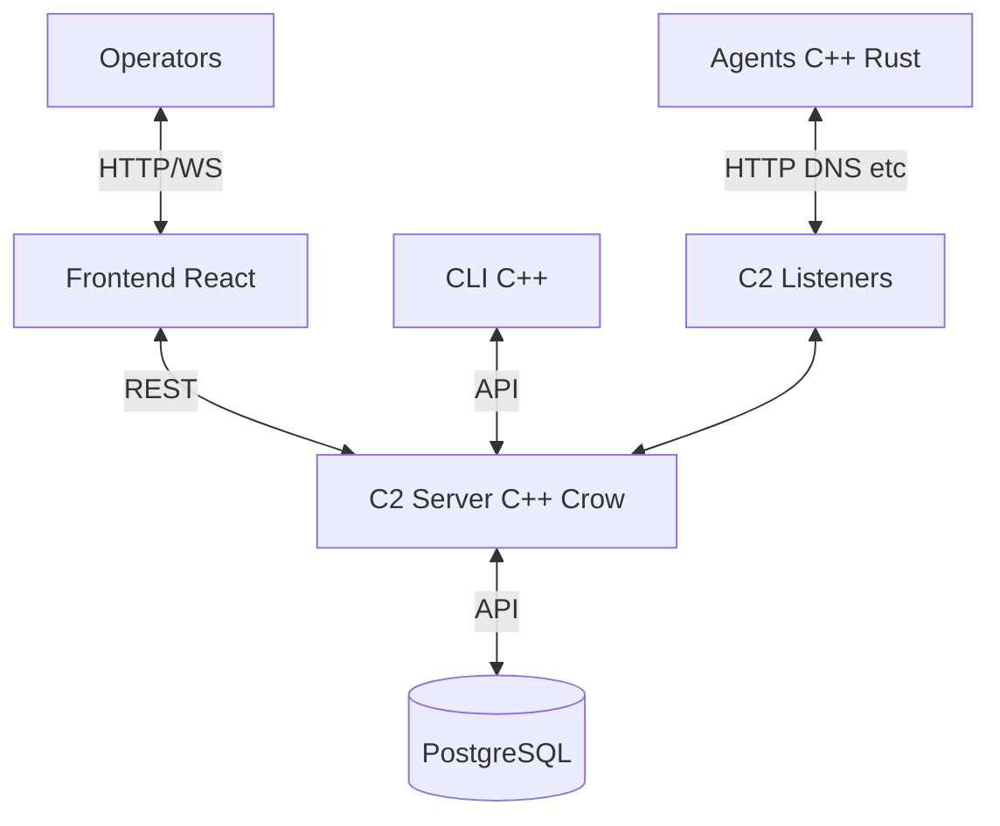

# Architecture

## Overview

This is an educational **Red Team Command & Control (C2)** framework. The system allows operators to manage compromised agents (implants), issue tasks, and retrieve results while emphasizing scalable, secure, and OPSEC-aware design.

**Core Principles**:
- **Separation of Concerns**: Backend API/Core, Database, Agents, Frontend, CLI.
- **API-First**: All interactions (agents, UI, CLI) go through well-defined REST/WebSocket endpoints.
- **Extensibility**: Modular tasking, plugin system, multi-transport support.
- **Performance & Reliability**: C++ core with async/threading where needed.
- **Educational & Realistic**: Mirrors real-world C2 frameworks (Covenant, Empire, Cobalt Strike) while remaining open and transparent.

## System Architecture Diagram (Text)

## Components

### 1. C2 Core Server (`backend/core`)
- **Framework**: Crow (lightweight C++ web server).
- **Responsibilities**:
  - HTTP(S) listener(s).
  - Agent check-in / beaconing.
  - Task queuing & result collection.
  - Authentication & authorization.
  - Logging & audit.
- **Key Classes**: `AgentManager`, `TaskManager`, `Database`.

### 2. Database Layer (`backend/db`)
- PostgreSQL.
- Tables: `agents`, `tasks`, `operators`, `audit_logs`, `campaigns` (future).
- Use prepared statements and connection pooling.

### 3. API Layer (`backend/api`)
- REST endpoints for agents, tasks, results, operators.
- OpenAPI/Swagger documentation (future).
- Rate limiting & input validation.

### 4. Agents (`backend/agents`)
- Platform-specific (Windows, Linux, macOS).
- Staged loaders.
- Sleep + jitter.
- Modular command execution (shell, file I/O, future modules).

### 5. Frontend (`frontend`)
- React + TailwindCSS (per roadmap).
- Real-time dashboard (agents list, task console, graphs).
- WebSocket support for live updates (future).

### 6. CLI (`backend/core/cli`)
- Operator commands for quick scripting/headless use.

## Data Models (Current + Planned)

- **Agent**: `agent_id`, `hostname`, `os`, `last_seen`, `status`, `metadata`.
- **Task**: `id`, `agent_id`, `task_type`, `parameters`, `status`, `result`, `timestamps`.
- **Operator**: Users with roles (future RBAC).

## Future Improvements & Enhancements

### Short-Term (v1 Completion)
- Implement full tasking loop (queue → poll → execute → result).
- Add proper configuration (YAML/JSON) for ports, DB creds, TLS certs.
- JWT authentication + basic RBAC.
- Robust error handling, structured logging (spdlog).
- Unit/integration tests (Catch2 or GoogleTest).
- Docker Compose for local dev (server + Postgres + frontend).
- Basic payload builder (generate agent binaries with config).

### Medium-Term (v2)
- **Multi-Transport**: HTTP/S, DNS tunneling, QUIC, WebSocket.
- **Malleable Profiles**: Profile-based communication (mimic legitimate traffic).
- **Plugin System**: Dynamic loading of modules (keylogger, screenshot, lateral movement).
- **Evasion Features**: Process injection, anti-analysis, sandbox detection in agents.
- **WebSocket / Real-time**: For live agent interaction in UI.
- **File Staging & Exfil**: Secure upload/download with encryption.
- **Campaign Management**: Group agents by operation.

### Long-Term (v3+)
- **Peer-to-Peer / Mesh Agents**: Resilient C2 without single point of failure.
- **Multi-Platform**: Full macOS + mobile (iOS/Android) support.
- **Advanced OPSEC**: Sleep masking, indirect syscalls, traffic obfuscation.
- **Analytics Dashboard**: Visualizations, anomaly detection on agent behavior.
- **Automation**: CI/CD for building agents, Terraform/Ansible deployment, automated testing.
- **Scalability**: Support multiple server instances, load balancing, sharded DB.
- **Integration**: With other red team tools (e.g., via API).
- **Monitoring & HA**: Health checks, failover, backup/restore.

### Non-Functional Improvements
- **Security**: TLS everywhere, secret management (Vault or env), input sanitization, rate limiting.
- **Performance**: Thread pools, async I/O (Boost.Asio or similar), connection pooling.
- **Observability**: Prometheus metrics + Grafana, distributed tracing.
- **Documentation**: Full API docs, agent development guide, deployment guide.
- **Licensing & Community**: Clear contribution guidelines, examples, demos.

## Deployment Architecture (Future)

- **Dev**: Docker Compose.
- **Prod/Op**: Kubernetes / bare metal with reverse proxy (Nginx/Traefik) + TLS.
- **Agents**: Compiled with embedded config or staged from server.

## Tech Stack Evolution
- **Core**: Stick with C++ or consider hybrid (C++ core + Rust agents for safety).
- **Frontend**: React + Vite + TanStack Query + Recharts.
- **Alternative Backend**: If complexity grows, evaluate migrating heavy lifting to Go or Rust.

---
